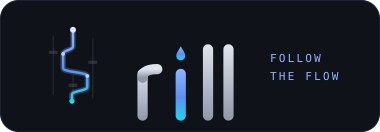
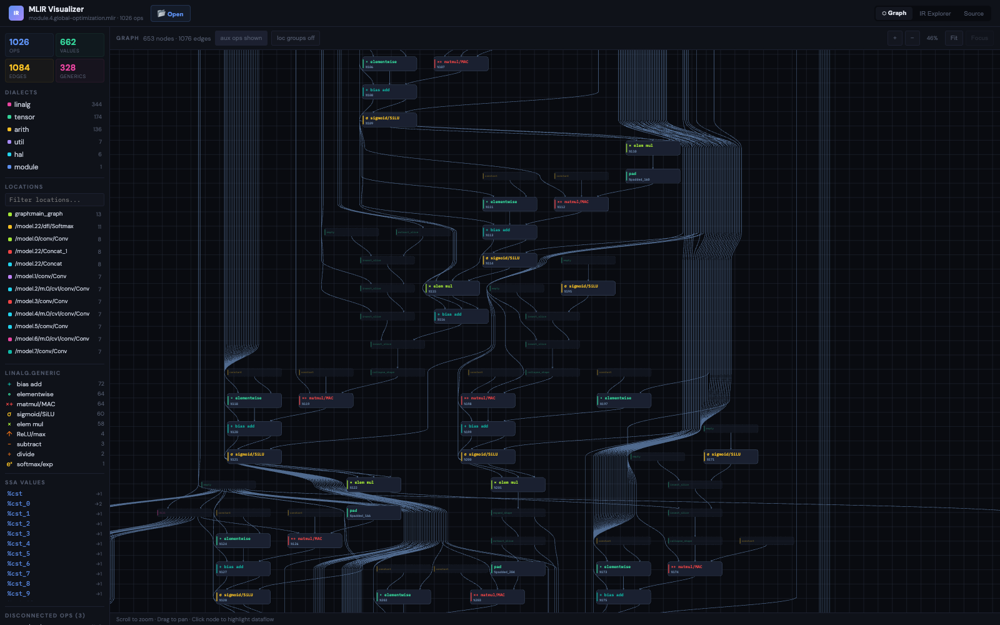
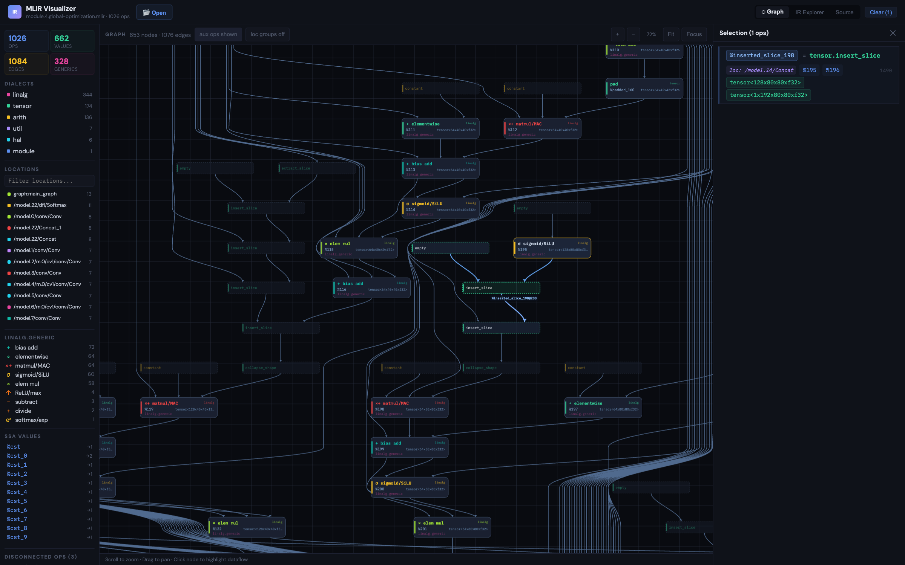
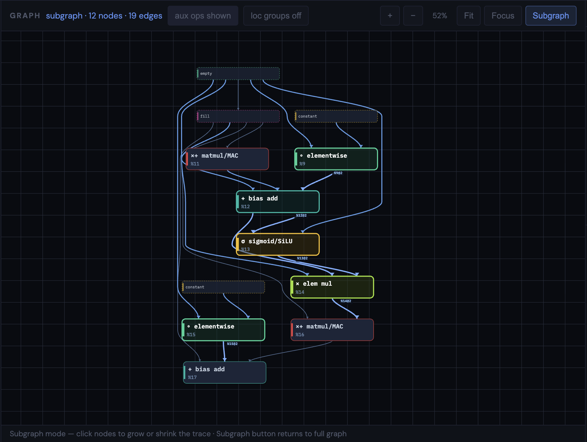
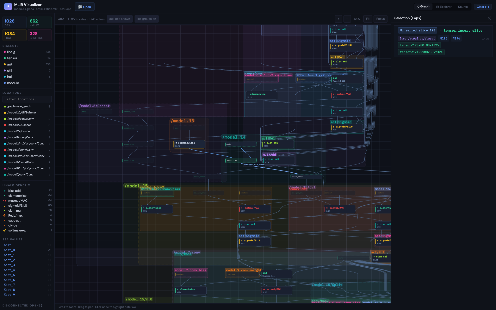
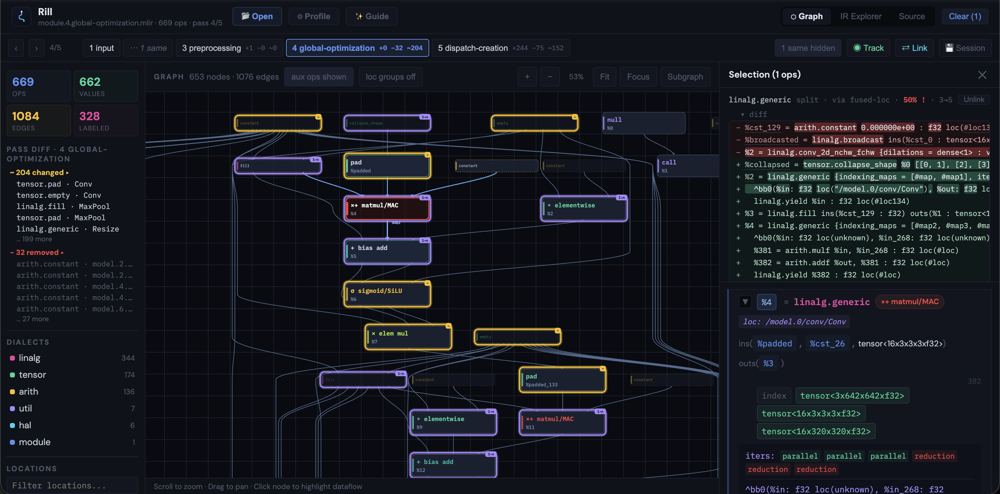

<div align="center">



**Turn walls of compiler IR into graphs you can actually read.**

Rill is an interactive, zero-backend graph viewer for [MLIR](https://mlir.llvm.org/) — it traces SSA dataflow through routed channels, built for inspecting real-world IR from [IREE](https://iree.dev/), torch-mlir, and friends, at the scale of full ML models.

**[Try Rill online →](https://rill.fluidmoment.ai/)**

[](LICENSE)
[](#testing)
[](#tech-stack)
[](#the-layout-engine)



*A YOLOv8n model (650+ ops, 1000+ edges) laid out automatically — op chains run vertically, long-range values flow through routed edge channels.*

</div>

---

## Why

Compiler IR dumps are thousands of lines of text. Answering simple questions — *where does this tensor come from? what consumes this convolution? why is there a `pad` here?* — means grepping SSA names across a wall of `linalg.generic`s. This tool parses the IR and shows you the dataflow instead.

Everything runs client-side: [open Rill](https://rill.fluidmoment.ai/), drop in a `.mlir` file, explore. `npm run build` even produces a **single self-contained HTML file** you can share or keep next to your IR dumps.

## Features

### 📊 Readable graphs at model scale

A hand-rolled layered layout engine (no dagre/ELK dependency) designed for the shape of real ML compiler IR:

- **Brandes–Köpf coordinate assignment** — op chains (`conv → bias → sigmoid → mul`) align into straight vertical spines with no sideways drift.
- **Routed edge channels** — values that skip dozens of layers (skip connections, concat inputs) travel in dedicated vertical gutters, snapped straight and fanned into parallel lanes so every edge in a bundle stays traceable.
- **Aux op collapsing** — constants, `tensor.empty`, broadcasts, slices, etc. can be hidden with their edges resolved transitively, leaving only the compute backbone.

### 🔍 Click-to-trace dataflow

Click any node to highlight its entire def-use chain and open a detail panel with operands, results, types, and location. Select multiple ops to compare them side by side.

<div align="center">

</div>

### 🔬 Subgraph mode

On a full model, the ops you care about are often scattered across the canvas, connected by edges that span half the graph. Select some nodes and hit **Subgraph**: just the selection and its direct neighbors are re-laid out as their own compact graph, so you can actually read how they connect. It stays interactive — clicking nodes grows or shrinks the trace live — and **stable layout reconciliation** keeps the nodes you're already looking at pinned in place while newly pulled-in nodes appear next to the neighbors that brought them in, so the picture never reshuffles under you. Hit **Subgraph** again (or clear the selection) to return to the full graph.

<div align="center">


*A 12-node trace pulled out of a 650+ op model: two conv blocks and the SiLU/mul chain between them, readable at a glance.*

</div>

### 🗺️ Location grouping

MLIR `loc(...)` metadata is parsed into a hierarchy (`/model.6/m.0/cv1/conv/Conv`), shown as an interactive sidebar and — with one toggle — as nested colored group boxes drawn straight onto the graph. Instantly see which ops came from which layer of the original model.

<div align="center">

</div>

### 🎞️ Pass-pipeline diff mode

Open **several `.mlir` files at once** — multi-select in the **📂 Open** dialog or drag-and-drop a whole dump folder's files — e.g. IREE's `--dump-compilation-phases-to=<dir>` output, or per-pass `--mlir-print-ir-after-all` snapshots saved to files. The files are naturally sorted (`module.2.*` before `module.10.*`) into a **pass timeline**, and Rill diffs every adjacent pair:

- **Automatic cross-pass op matching** — no compiler instrumentation, just the textual dumps. A tiered matching engine maps ops across each pass using symbol names, `loc(...)` provenance (fused locs reveal **1→n splits** from lowering and **n→1 merges** from fusion), op fingerprints, and graph-neighborhood similarity — falling back to structural alignment for loc-less IR (stripped MLIR, Caffe imports). Every match records how it was made; hover a diff ring to see the method and confidence.
- **Diff overlays on the graph** — nodes gain rings for what the incoming pass did: green `+` added, yellow `~` changed, purple `1→n` split / `n→1` merged. Eliminated ops are drawn as **ghosts** placed where the removal *means* something: `replaced by X` (an added op took over its edges), `folded` (its producer now feeds its consumer directly), or beside a surviving neighbor. The sidebar lists the pass's added / changed / removed ops — clicking a removed op highlights where it went.
- **Git-style op diff** — selecting a changed op shows a token-level diff against its previous-pass counterpart, with pure SSA/alias renames rendered as faint dotted underlines so renumbering noise never hides the attribute that actually changed.
- **Timeline strip** — one chip per snapshot with `+a −r ~c` badges. Passes that changed nothing collapse into "⋯ n same" pills (a 100-pass dump usually has ~10 real changes); step with **`[` / `]`** and collapsed passes are skipped. Matching runs in the background on idle ticks, so even huge series stay responsive.
- **Stable stepping** — layouts are computed fresh per snapshot, but the camera pans by the median displacement of surviving nodes, so stepping a pass feels like the graph morphing rather than teleporting.

<div align="center">


*Stepping into IREE's `global-optimization` phase: the timeline shows per-pass `+ − ~` badges (an unchanged pass is collapsed), the sidebar lists the 204 changed / 32 removed ops, and the selected `matmul/MAC` — part of a `3→5` split matched via fused-loc provenance — shows its diff: a `linalg.conv_2d_nchw_fchw` rewritten into `linalg.generic`s.*

</div>

### 🛰️ Track ops across passes

Select nodes and hit **◉ Track**: a colored halo follows those ops through *every* snapshot, chased forward and backward through the match graph. The sidebar shows each probe's event trail — `split 1→4`, `merged 3→1`, `eliminated`, `materialized` — tagged with the pass where it happened, so "where did my convolution go?" has a one-glance answer. When the matcher gets a pair wrong, select ops and use **⇄ Link** to manually map them onto ops in an adjacent pass (or unlink an automatic match); manual corrections override the engine.

### 💾 Debug sessions

**💾 Session** saves the whole investigation as a small JSON — snapshot *references* (file names + content hashes, never the IR text itself), tracked probes, manual links, notes. Drop the JSON back onto Rill later and re-pick the dump files: they're re-attached by name or by content hash, with warnings if a file's content changed since the session was saved. The format is specified in [docs/schema/session.schema.json](docs/schema/session.schema.json).

### 🧠 Smart `linalg.generic` classification

`linalg.generic` bodies are analyzed and labeled by what they actually compute — `matmul/MAC`, `sigmoid/SiLU`, `bias add`, `elem mul`, `leaky ReLU`, `softmax/exp`, … — so a sea of anonymous generics becomes a legible network diagram.

### 🧩 Dialect profiles (bring your own dialect)

All dialect knowledge — which ops are structural noise vs. compute, how regions are parsed, purpose labels, colors — lives in declarative JSON **profiles**, not code. Load one via the **⚙ Profile** button to teach Rill your custom dialect; the format is documented in [docs/PROFILE_SPEC.md](docs/PROFILE_SPEC.md) and designed so you can hand the spec + a sample IR dump to an AI assistant and get a working profile back. A **Profile debug** toggle shows exactly which rule matched each op, and validation errors are written to be pasted straight back into the loop. See [docs/examples/acc-accelerator.json](docs/examples/acc-accelerator.json) for a complete example, and [docs/schema/profile.schema.json](docs/schema/profile.schema.json) for the machine-checkable JSON Schema.

### 🥣 Caffe prototxt import (bring your own format)

Rill also opens **Caffe `.prototxt`** networks — standard, legacy V1 (`layers` lists, `CONVOLUTION` enum types), and custom forks with unknown layer types. The same profile JSON can carry an **`import` section** that declaratively maps any protobuf-text variant onto the graph: which field is the layer list, where names/types/inputs/outputs live, enum→name tables, param extraction, per-layer subtitles, and name-based grouping. The format is documented in [docs/IMPORT_SPEC.md](docs/IMPORT_SPEC.md) and built for the same AI loop: hand the spec + a demo prototxt of your variant to an assistant and load the JSON it returns — no parser code. See [src/extensions/profiles/caffe.json](src/extensions/profiles/caffe.json) for the built-in mapping.

### 🧭 Three synced views

| View | What it shows |
|------|---------------|
| **Graph** | Interactive canvas — pan, zoom, fit, focus-on-selection, dataflow highlighting |
| **IR Explorer** | Structured op tree with expandable regions and clickable SSA values |
| **Source** | Line-numbered original text with value highlighting |

Plus a sidebar with op/value/edge stats, per-dialect counts and coloring, a filterable location list, the `linalg.generic` classification breakdown, and every SSA value in the module.

## Quick start

Use the hosted app at **[rill.fluidmoment.ai](https://rill.fluidmoment.ai/)**—no installation required—or run Rill locally:

```bash
git clone https://github.com/CuteCake/rill
cd rill
npm install
npm run dev        # → http://localhost:5173
```

Click **📂 Open** and load any `.mlir` file (a demo module is preloaded). Any textual MLIR works — e.g. IREE's per-phase dumps via `--dump-compilation-phases-to=<dir>`. Select **multiple files** to enter [pass-pipeline diff mode](#️-pass-pipeline-diff-mode) with a timeline across them. The screenshots above are a YOLOv8n model compiled with IREE. Caffe `.prototxt` files open the same way — the format is detected automatically — and a saved `.rill-session.json` reopens a previous debug session.

```bash
npm run build      # produces a single standalone HTML file in dist/
npm test           # run the test suite
```

## How it works

```
src/
├── App.jsx                   # Root component, view routing, state
├── parser/
│   ├── index.js              # Front-end dispatch (MLIR vs. imported formats)
│   ├── mlir-parser.js        # MLIR text → structured op array (pure, no DOM)
│   ├── prototxt.js           # Generic protobuf text-format parser (Caffe syntax)
│   ├── import-map.js         # Declarative message-tree → op-array mapping
│   └── infer-generic.js      # linalg.generic body → purpose classification
├── graph/
│   ├── build-graph.js        # SSA def-use chain extraction
│   ├── layout.js             # Layered graph layout engine
│   └── canvas-renderer.js    # Pure Canvas 2D drawing
├── pipeline/
│   ├── snapshot-store.js     # Lazy parse/graph/match cache per snapshot
│   ├── match.js              # Cross-pass op matching engine (4 tiers)
│   ├── node-key.js           # Stable op identities for probes & overrides
│   ├── lineage.js            # Probe lineage through cached MatchSets
│   ├── ghosts.js             # Removed-op classification (replaced/folded)
│   ├── step-context.js       # Diff overlay sets, camera anchoring
│   ├── text-diff.js          # Token-level op diff, rename-aware
│   └── session.js            # Session save/load + file re-attachment
└── components/
    ├── GraphView.jsx         # Pan / zoom / selection interaction
    ├── Sidebar.jsx           # Stats, dialects, locations, pass diff, probes
    ├── Timeline.jsx          # Pass-pipeline strip (chips, badges, pills)
    ├── NodeDiff.jsx          # Git-style cross-pass op diff
    ├── IRExplorer.jsx        # Structured op tree
    └── SourceView.jsx        # Line-numbered source
```

The parser is pure (`string → data`), the renderer is pure (`layout → pixels`), and layout is deterministic and memoized — same input, same picture.

### The layout engine

A Sugiyama-style pipeline tuned for ML compiler IR, where a mostly-sequential spine meets very long skip edges:

1. **Filter & resolve** — structural ops (`module`, `func`, `hal.*`, …) are hidden; collapsed aux ops have their edges chased transitively.
2. **Layering** — longest-path via Kahn's algorithm, then ALAP sinking so producers sit next to their consumers (a constant used at layer 40 appears at layer 39, not layer 0).
3. **Crossing reduction** — up to 24 bidirectional barycenter passes plus adjacent-swap refinement; edges spanning multiple layers participate through dummy waypoints.
4. **Coordinate assignment** — [Brandes–Köpf](https://link.springer.com/chapter/10.1007/3-540-45848-4_3) four-way alignment for real nodes: straight chains, balanced medians, no cumulative drift.
5. **Channel routing** — long-edge waypoints are deliberately *excluded* from the rigid alignment blocks (interleaved rigid chains would inflate graph width ~4–10×). Instead each chain is confined to the corridor the crossing reduction assigned it, relaxed smooth, snapped to straight vertical runs, and fanned into parallel 6 px lanes ordered by destination — bundles read like ribbon cables and never braid.
6. **Port spreading** — edges sharing a node spread across its width instead of stabbing one point.

<details>
<summary><b>What appears on the canvas (and what doesn't)</b></summary>

The graph focuses on **dataflow** (SSA def-use chains). Some parsed ops are intentionally omitted:

| Category | Treatment |
|----------|-----------|
| Compute ops with SSA results + edges | Full nodes, always shown |
| Aux ops (`arith.constant`, `tensor.empty`, `util.global.load`, `linalg.broadcast`, `linalg.fill`, `tensor.{extract,insert}_slice`, `tensor.{expand,collapse}_shape`, `linalg.transpose`) | Small dashed nodes — toggle with **aux ops** |
| Structural ops (`module`, `func.*`, block labels, `util.global`, `hal.*`) | Never drawn (program structure, not dataflow) |
| Terminators & side-effect-only ops (`return`, `yield`, stores) | Never drawn (no SSA results → no def-use edges) |
| Disconnected ops (results but no edges) | Sidebar "Disconnected Ops" list |

When aux ops are collapsed, edges are **chased transitively** through the hidden ops (`conv → constant → matmul` becomes `conv → matmul`) and deduplicated per op pair. Block/function arguments have no producer node, so their consumers appear as roots.

</details>

<details>
<summary><b>Parser output shape</b></summary>

Each parsed op is a plain object:

```js
{
  id: 42,
  line: 67,                        // 1-indexed source line
  opName: "linalg.conv_2d_nchw_fchw",
  dialect: "linalg",
  results: ["%14"],
  operands: ["%padded_3", "%12"],
  types: ["tensor<1x256x28x28xf32>"],
  attrs: { ins: "...", outs: "..." },
  loc: "/model.0/conv/Conv",       // from loc(...) metadata
  children: [],
  parentId: 3,
  genericBody: null,               // non-null for linalg.generic
}
```

</details>

## Testing

```bash
npm test              # run once
npm run test:watch    # watch mode
```

238 tests cover parser correctness (SSA extraction, nesting, `loc` tracing, generic bodies), prototxt parsing and import mapping (in-place layer versioning, legacy variants, dispatch), profile validation (runtime validator + JSON Schema agreement), graph building, layout invariants (no overlapping nodes, aux collapsing, ALAP sinking, fan-out), `linalg.generic` inference against real IR, and the pass-pipeline machinery — cross-pass matching (splits, merges, fused locs, manual overrides), probe lineage, removed-op classification, rename-aware text diffing, session round-tripping and file re-attachment.

## Roadmap

- [ ] Minimap for large graphs
- [x] Graph node search + focus
- [ ] Export graph as SVG/PNG
- [x] Diff across MLIR files — shipped as [pass-pipeline diff mode](#️-pass-pipeline-diff-mode) (timeline, op matching, ghosts, tracking, sessions)
- [ ] Custom collapsing rules (user-defined op visibility)
- [x] Virtualized IR Explorer for 10k+ ops
- [x] Subgraph selection — shipped as interactive [subgraph mode](#-subgraph-mode) with stable grow/shrink re-layout

## Tech stack

**React 18** for UI · **Vite** for dev/build (single-file output via `vite-plugin-singlefile`) · **Canvas 2D** for rendering · **Vitest** for tests · zero graph-layout dependencies.

## License

[MIT](LICENSE)
